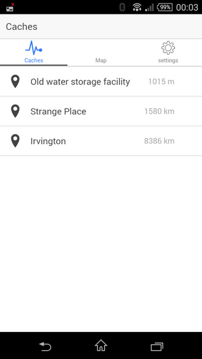
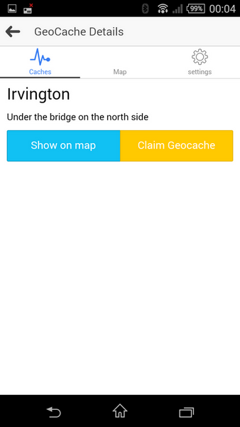
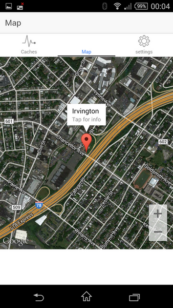
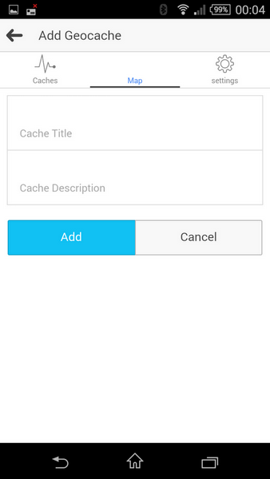

This is a sample geocaching iconic app with google maps plugin.
You need API keys to run it.
Links:
http://ionicframework.com/
https://github.com/wf9a5m75/phonegap-googlemaps-plugin

Screenshots:

 
  
 

currently not implemented:
-backend 
-geocache adding/removing